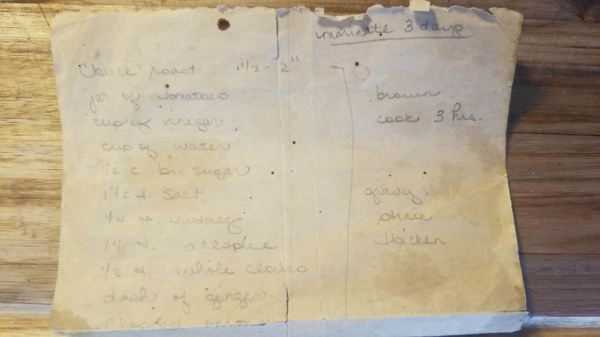

This winter I'm taking on the challenge to fill in the blanks on an old family recipe. Sauerbraten was a staple of my childhood. It was just as likely to be served at family get-togethers as it was on any given weeknight dinner. 

The new-world addition of tomatoes makes it unconventional but the family tradition in this recipe predates even my grandparents. It is intended to be served over egg noodles and topped with toasted corn flake cereal. You won't find either of these ingredients on the recipe card, which tells you a little about why I'm trying to capture this now. My father has been a great source of advice on how to make it, mainly from his own experience in making it himself. 

I think it would be a mistake to try and modernize this recipe. That's always a risk when undertaking a project like this but I want to reuse my family's techniques and ingredients as much as possible. My only goal is to add specificity where currently none exists. This experience has already got me wondering just how much family knowledge has been lost to time. One project at a time I suppose.
